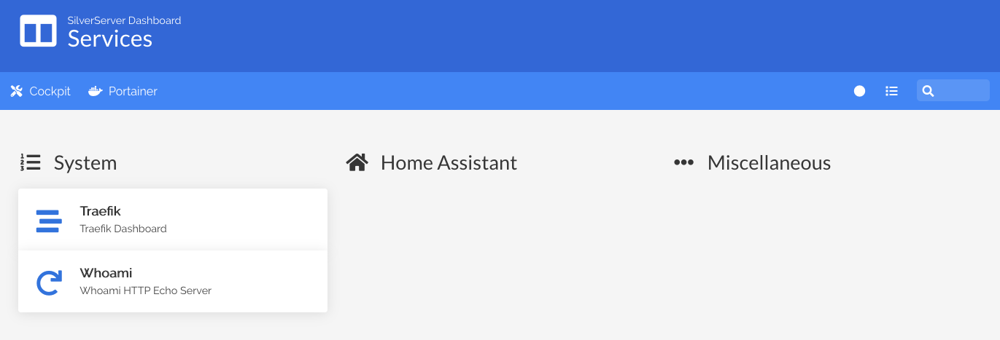

# compose-stacks

This is a repository for all the docker-compose stacks I'm using for powering my home NAS.

## Auto-generated Dashboard by Homer

The `secure-router` stack includes an autogenerating dashboard that shows all annotated services on the NAS, and Traefik provides a single entrypoint that can be used to add authentication to any endpoint by annotations as well.

### Disclaimer
The files contained in here are should not be used for any production systems.

I'm still working on this project, so things will be changing frequently.